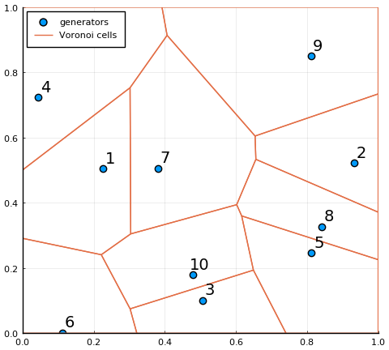

VoronoiCells
============

[](https://github.com/robertdj/VoronoiCells.jl/actions)
[](https://codecov.io/github/JuliaGeometry/VoronoiCells.jl?branch=master)

*VoronoiCells* use the [VoronoiDelaunay](https://github.com/JuliaGeometry/VoronoiDelaunay.jl) package to compute the vertices and areas of the Voronoi cells in a tessellation.
Furhtermore, *VoronoiCells* handles interaction with the specified observation rectangle.


# Installation

Switch to `Pkg` mode in Julia with `]` and run

```julia
add VoronoiCells
```


# Usage

For specifying 2D points I use the [GeometryBasics package](https://github.com/JuliaGeometry/GeometryBasics.jl).
Using the [Plots package](https://github.com/JuliaPlots/Plots.jl) we can easily visualize Voronoi tesselations.
To make this document reproducible, I also used a random point pattern with a fixed seed.

```julia
using VoronoiCells
using GeometryBasics
using Plots
using Random
```


First make a vector of points and a rectangle that contains the points:

```julia
Random.seed!(1337)
rect = Rectangle(Point2(0, 0), Point2(1, 1))
points = [Point2(rand(), rand()) for _ in 1:10]
```

```
10-element Array{GeometryBasics.Point{2,Float64},1}:
 [0.22658190197881312, 0.5046291972412908]
 [0.9333724636943255, 0.5221721267193593]
 [0.5052080505550971, 0.09978246027514359]
 [0.04432218813798294, 0.7229058081423172]
 [0.8128138585478044, 0.24545709827626805]
 [0.11201971329803984, 0.0003419958128361156]
 [0.3800005018641015, 0.5052774551949404]
 [0.8411766784932724, 0.3265612016334474]
 [0.8108569785026885, 0.8504559154148246]
 [0.47805314311674496, 0.17906582198336407]
```


The main function of *VoronoiCells* is `voronoicells` that computes the cell of each generator point.

```julia
tess = voronoicells(points, rect);
```


The output `tess` is a struct.
The corners of the Voronoi cells of the `n`'th generator is available as `tess.Cells[n]`.
The corners are sorted counter-clockwise.

```julia
tess.Cells[1]
```

```
5-element Array{GeometryBasics.Point{2,Float64},1}:
 [0.0, 0.5006658246439761]
 [0.0, 0.2909467571782577]
 [0.22132548929287787, 0.24066681274894675]
 [0.3041376415938776, 0.3046324682958502]
 [0.30224294454977085, 0.7530369438246255]
```


There is a convenience function for plotting the edges of the Voronoi cells.
The generators are not added, but here I add them separately.

```julia
scatter(points, markersize = 6, label = "generators")
annotate!([(points[n][1] + 0.02, points[n][2] + 0.03, Plots.text(n)) for n in 1:10])
plot!(tess, legend = :topleft)
```




The function `voronoiarea` computes the area of each Voronoi cell:

```julia
voronoiarea(tess)
```

```
10-element Array{Float64,1}:
 0.10905486942527855
 0.07490860886924389
 0.05461848195251296
 0.1295227626242153
 0.0943320987129441
 0.07231514118679619
 0.14583818637774296
 0.06295556177551635
 0.17457664323539532
 0.08187764584035444
```


# Technical notes

My main interest is the area of the Voronoi cells and not the cells *per se*. 
The current representation of a cell as its corners in a vector is by no means set in stone, so reach out if you think another representation is more suitable.


## Corners

For technical reasons the *VoronoiDelaunay* package only works with points in the rectangle [1, 2] x [1, 2] -- here referred to as the VoronoiDelaunay rectangle.
Furthermore, *VoronoiDelaunay* includes the corner points of the rectangle in the set of generators.
We can emulate the behavior in *VoronoiCells* by explicitly including the corners:

```julia
extended_points = vcat(points, VoronoiCells.corners(rect))
extended_tess = voronoicells(extended_points, rect);
```


Plotting this tesselation we see that the cells neighboring the corners are affected, namely the cells of points 1, 4, 5, 6, 9.

```julia
scatter(points, markersize = 6, label = "generators")
annotate!([(points[n][1] + 0.02, points[n][2] + 0.03, Plots.text(n)) for n in 1:10])
plot!(extended_tess, legend = :none)
```


*VoronoiCells* circumvents this in the following manner:
The set of transformed generators are augmented with the corners of the VoronoiDelaunay rectangle.
All points in the augmented generators are mapped to a rectangle called the computational rectangle with the following properties:

- It is a (non-empty) subset of the VoronoiDelaunay rectangle
- The Voronoi cells of the augmented generators belonging to the corners of the VoronoiDelaunay rectangle do not overlap with the computational rectangle.

This does not uniquely define a computational rectangle, but in theory any candidate will suffice.
The intersection of the computational rectangle and the Voronoi cells of the transformed generators are transformed versions of their Voronoi cells in the original rectangle.
Transforming these cells back to the original rectangle give the desired Voronoi tesselation.

Note that in order to consider point patterns in general rectangles such a mapping has to be applied anyway, so we are not introducing unnecessary computational cost.

The closer the generators are to the edges/corners of the original rectangle, the larger the computational rectangle can be.
In order to avoid additional preprocessing I use a conservative minimal rectangle with corners (1.5 + x, 15 + x), (1.5 - x, 1.5 + x), (1.5 - x, 1.5 - x), (1.5 + x, 1.5 - x) where x = 1/6.
If we can assume that all quadrants of the original rectangle contains points we can set x = 1/4.

**Reach out if this small rectangle is causing trouble.**

One extra step that *is* necessary is to figure out which Voronoi cell(s) the corners of the rectangle belongs to.
This is determined by finding the point(s) with the smallest distance to each of the corners.


# Weave

This README is generated with the [Weave package](https://github.com/JunoLab/Weave.jl) using the command

```julia
weave("README.jmd", doctype = "github", fig_path = "doc")
```
