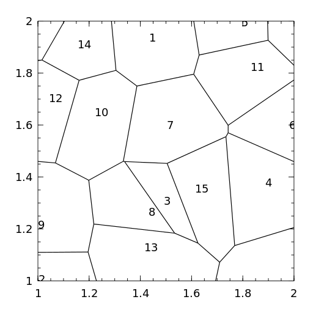
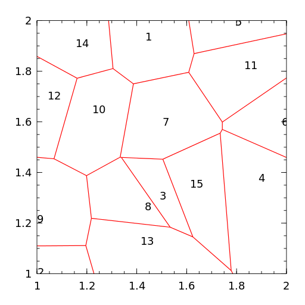

Removing the corners of the bounding box
========================================

*VoronoiCells* use the [VoronoiDelaunay](https://github.com/JuliaGeometry/VoronoiDelaunay.jl) package as a black box for accessing the line segments of a Voronoi tessellation.

In VoronoiDelaunay all generators reside inside the square [1,2]x[1,2] and the four corners of this square are always included as generators.
This of course adds four extra cells (here denoted "corner cells") to the tessellation and the cells bordering the corner cells are *incorrect*.
In the example below the cells belonging to the points 1, 2, 3 (upper right), 2, 12, 14 (upper left), 5, 6 (lower left) and 8 (lower right) are affected.

Some papers have been published on how to remove generators and update the affected cells, but to the best of my knowledge they all assume that specific data structures are used for representing the Voronoi tessellation (e.g. [half-edge](https://en.wikipedia.org/wiki/Doubly_connected_edge_list) or [quad-edge](https://en.wikipedia.org/wiki/Quad-edge) structures) and VoronoiDelaunay does not use these.

In *VoronoiCells* we rely on linear transformations:
All generators are in [1,2]x[1,2] and they are transformed to the middle square [1.25,1.75]x[1.25,1.75].

In this middle square the distance to a corner point is greater than any mutual distance between the transformed points.
Hence if we compute the Voronoi tessellation with the transformed points, the corners cells do not overlap the middle square.

Transforming the generators and their Voronoi cells back to the full square [1,2]x[1,2], the intersection between each cell and the full square is correct.

The line segments making up the Voronoi cells are a priori not restricted to the bounding box and *VoronoiCells* use the [Liang-Barsky algorithm](https://en.wikipedia.org/wiki/Liang%E2%80%93Barsky_algorithm) to compute the intersection between a line segment and the bounding box.

One final correction after computing the correct line segments is to assign the corners to the correct cells.
In the examples above the upper right corner belongs the cell of point 1. 
This is determined by keeping track of the cells neighboring the corner points during the line segment computation and afterwards determine the appropriate generator by calculating the distance between a corner and each of its former neighbor generators.

